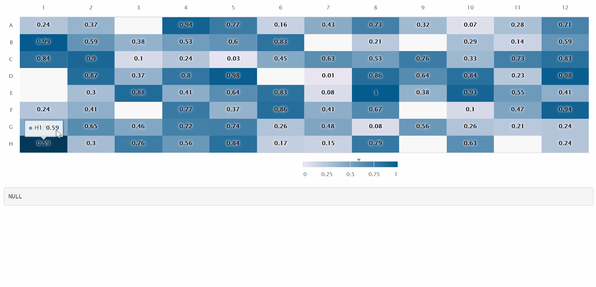

# heatmapPlateMod
A shiny module for plotting microplate data as a heatmap

### Introduction

This is a highcharter package based shiny module that can plot microplate data as heatmap and return infomation from user selected wells.


### Pre-request

This shiny module requires following packages. Please make sure they are installed.

```r
install.package('dplyr')
install.package('tidyr')
install.package('highcharter')
```

### Usage

1. Source the module file

  ```r
  source('heatmapPlateMod.R')
  ```
  
2. In server function, create a shiny reactive object that contains microplate data in dataframe format: 

  ```r
  server <- function(input, output) {

    # The microplate dataframe should contain at least tow columns:
    # Well: the well id of microplate (eg, A1, A2, B5, D12) 
    # Value: the value of that well to be displayed as heatmap
    # The dataframe may contain other columns and will be ignored.
    
    microplate <- reactive({
      expand.grid(Row = LETTERS[1:8], Col = as.character(1:12),
                  stringsAsFactors = F) %>%
      unite(Well, Row, Col, sep = '') %>%
      mutate(Value = runif(n())) %>%
      sample_frac(0.9)
    })
  
    # other codes

  }
  ```

3. Invoke module in server function and send the microplate data object to the `data` parameter:

  ```r
  selected <- callModule(hmplate, id = 'YOU_MODULE_ID', data = microplate)
  ```

4. Add heatmap output ui

  ```r
  ui <- fluidPage(

    hmplateUI('YOU_MODULE_ID')

  )
  ```

5. Run app. Select wells by Ctrl/Shift + Click. The module returns a subsetted dataframe according to the selection.


